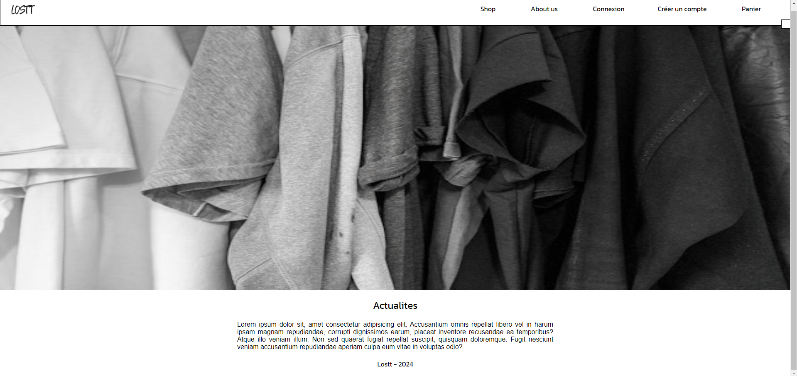
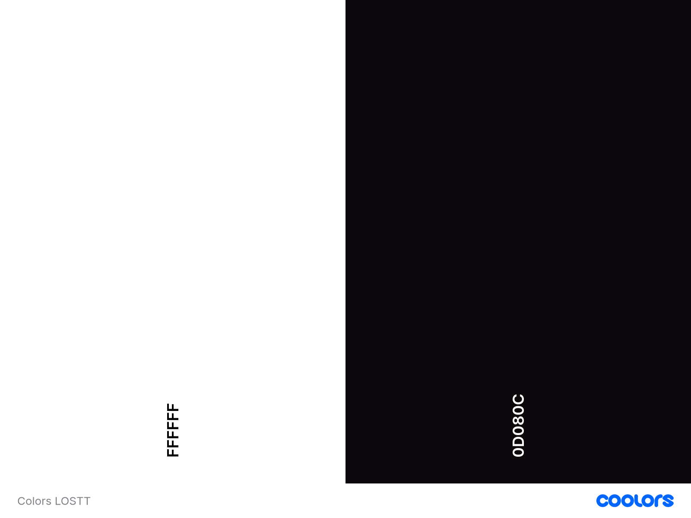

# Lostt

## Conception & Realisation : LOPEZ Lucas

>Voici le repertoire Github de la maquette de mon projet professionnel que j'ai realise au cours de mon Bachelor a l'ecole ITIC Paris.

>Ce projet part d'un reve que j'ai avec un ami a moi, qui serait de lancer notre marque de vetements.

>Ici vous y retrouverez l'interface statique de ce projet.

## Interface du projet 

## Charte graphique
>Police : Kanit 

>Couleurs :

>Logo :
